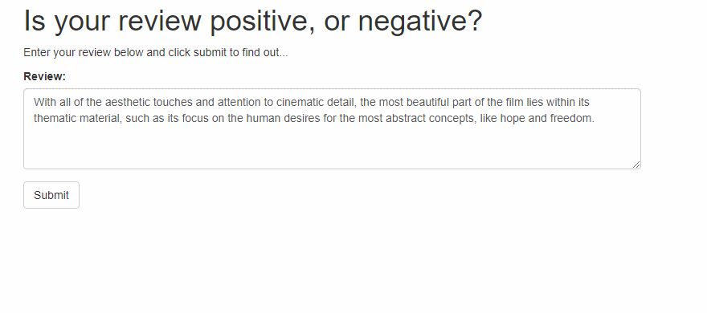

# AWS SageMaker Deployment Project

Web Application complete with a RNN trained for Sentiment Analysis and Web API built, trained, and deployed through AWS SageMaker. Final Udacity Deep Learning Nanodegree project.

# Project Overview
This project provides a sentiment analysis web application for users - trained on the [IMDb Dataset](http://ai.stanford.edu/~amaas/data/sentiment/). The project was built, trained, and deployed through Amazon's Web Services including: SageMaker, API GateWay, and Lambda Functions.
> Maas, Andrew L., et al. [Learning Word Vectors for Sentiment Analysis](http://ai.stanford.edu/~amaas/data/sentiment/). In _Proceedings of the 49th Annual Meeting of the Association for Computational Linguistics: Human Language Technologies_. Association for Computational Linguistics, 2011.

## User Interaction
Users input a review or sentence of his or her choosing into the web application, clicks Submit, and will receive the review's predicted sentiment of Good or Bad.

# High-Level Data Flow
1. User inputs Review into Web App
2. Review is sent to AWS Gateway API
3. AWS Gateway API Sends the Review to the Preprocessing Lambda Function
4. Lambda Function preprocesses the data then invokes the Deployed Model's Endpoint for inference
5. Model Returns predicted sentiment to Lambda Function
6. Lambda function returns result to AWS Gateway API
7. Result returned to Web App to User

